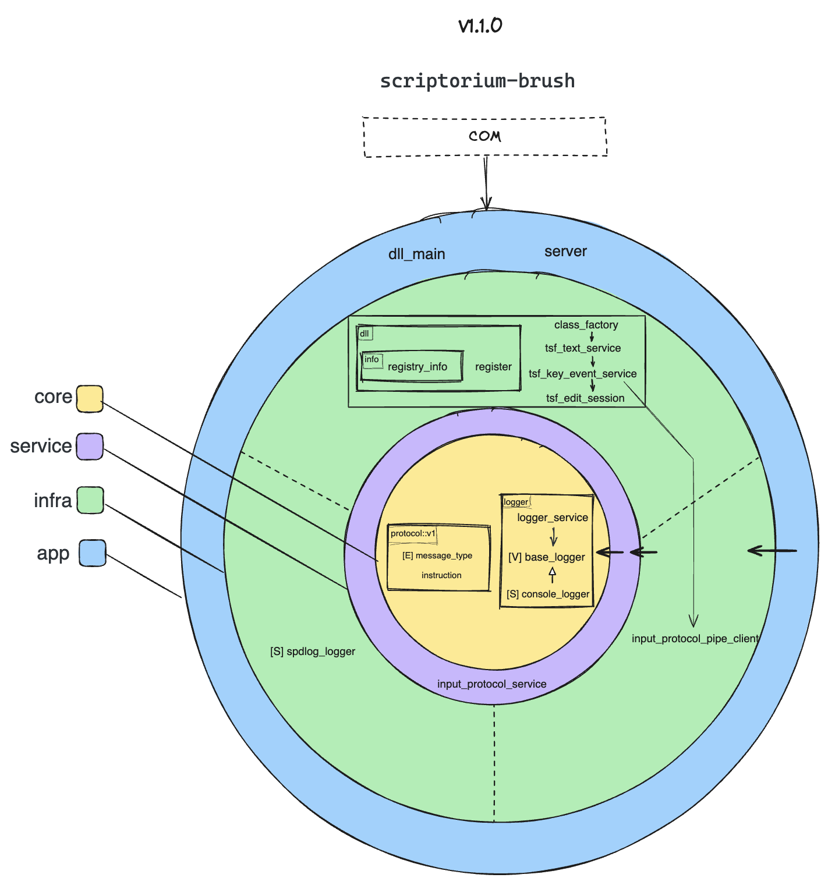
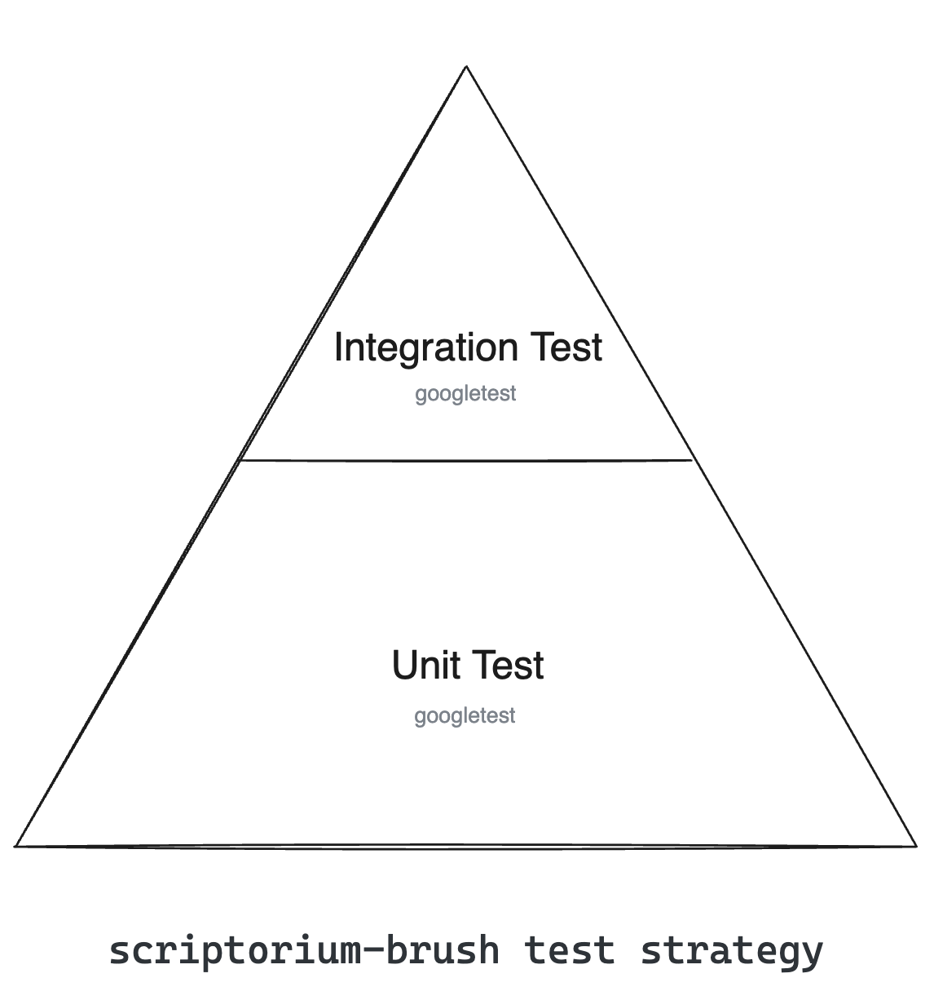

# Scriptorium Brush

[](https://github.com/ScriptoriumLab/scriptorium-brush/actions/workflows/scriptorium-ime-brush-platform-ci.yml)

```
================================================================================================================================================

█████████                      ███             █████                        ███                                █████                 █████    
███▒▒▒▒▒███                    ▒▒▒             ▒▒███                        ▒▒▒                                ▒▒███                 ▒▒███     
▒███    ▒▒▒   ██████  ████████  ████  ████████  ███████    ██████  ████████  ████  █████ ████ █████████████      ▒███         ██████   ▒███████ 
▒▒█████████  ███▒▒███▒▒███▒▒███▒▒███ ▒▒███▒▒███▒▒▒███▒    ███▒▒███▒▒███▒▒███▒▒███ ▒▒███ ▒███ ▒▒███▒▒███▒▒███     ▒███        ▒▒▒▒▒███  ▒███▒▒███
▒▒▒▒▒▒▒▒███▒███ ▒▒▒  ▒███ ▒▒▒  ▒███  ▒███ ▒███  ▒███    ▒███ ▒███ ▒███ ▒▒▒  ▒███  ▒███ ▒███  ▒███ ▒███ ▒███     ▒███         ███████  ▒███ ▒███
███    ▒███▒███  ███ ▒███      ▒███  ▒███ ▒███  ▒███ ███▒███ ▒███ ▒███      ▒███  ▒███ ▒███  ▒███ ▒███ ▒███     ▒███      █ ███▒▒███  ▒███ ▒███
▒▒█████████ ▒▒██████  █████     █████ ▒███████   ▒▒█████ ▒▒██████  █████     █████ ▒▒████████ █████▒███ █████    ███████████▒▒████████ ████████ 
▒▒▒▒▒▒▒▒▒   ▒▒▒▒▒▒  ▒▒▒▒▒     ▒▒▒▒▒  ▒███▒▒▒     ▒▒▒▒▒   ▒▒▒▒▒▒  ▒▒▒▒▒     ▒▒▒▒▒   ▒▒▒▒▒▒▒▒ ▒▒▒▒▒ ▒▒▒ ▒▒▒▒▒    ▒▒▒▒▒▒▒▒▒▒▒  ▒▒▒▒▒▒▒▒ ▒▒▒▒▒▒▒▒  
                                    ▒███                                                                                                      
                                    █████                                                                                                     
                                    ▒▒▒▒▒                                                                                                      

================================================================================================================================================
```

## 1. Introduction

**Scriptorium Brush** is the **Windows Client (Sensor & Actuator)** for the Scriptorium IME ecosystem.

It is a lightweight **In-Process DLL** built upon the Microsoft Text Services Framework (TSF). Unlike traditional IMEs, `scriptorium-brush` contains **no logic, no dictionary, and no UI**. Its sole responsibilities are:

1.  **Sensor**: Intercept OS key events via TSF.
2.  **Messenger**: Normalize events and forward them to the `scriptorium-inkstone` core server via Named Pipes.
3.  **Actuator**: Receive text composition commands from the server and commit text to the application.

This design ensures maximum **crash resistance**—even if the core engine fails, the host application (e.g., Word, Notepad) remains unaffected.

## 2. Architecture

Scriptorium Brush follows the **Clean Architecture** principles, acting as the interface adapter between the Windows OS and the Scriptorium Core Protocol.



* **Infra Layer**: Handles raw TSF COM interfaces (`ITfTextInputProcessor`) and Named Pipe communication.
* **Core Layer**: Defines the protocol and event structures, remaining purely independent of Windows headers.

---

## 3. Test Strategy

Since `scriptorium-brush` is a DLL deeply integrated with Windows COM/TSF, our testing strategy focuses on isolation and integration:

* **Unit Tests**: Focus on the `Adapter Layer`. We verify that raw `WPARAM`/`LPARAM` inputs are correctly converted into Scriptorium's `InputEvent` JSON protocol.
* **Integration Tests**: Mock the `Named Pipe Server` to verify that the Brush client can correctly connect, send heartbeats, and handle reconnection scenarios.



---

## 4. Roadmap & Tech Debt

Since the heavy lifting has moved to `scriptorium-inkstone`, the roadmap for Brush is focused on **stability** and **protocol normalization**.

### TSF & Input Handling
- [ ] **Refactor TSF Key Event Handling (Critical)**
  - Normalize `WPARAM`/`LPARAM` into a platform-independent **KeyEvent abstraction**.
  - Stop treating `WPARAM` as `wchar_t`; extract **VK**, **ScanCode**, and **modifiers**.
  - Use `ToUnicodeEx` to translate keys into **UTF-8** characters before sending to Core.
  - Route **control keys** (Backspace, Enter, Arrows) via a dedicated `handle_raw_keydown` path.
- [ ] Refactor `tsf_key_event_service` to use `std::unique_ptr` for better lifecycle management.

### IPC & Stability
- [ ] **Robust Reconnection**: Implement exponential backoff strategies when the `scriptorium-inkstone` server is unreachable or restarts.
- [ ] **Fail-safe Mode**: If IPC fails, ensure the IME acts as a pass-through (transparent) keyboard to prevent blocking user input.
