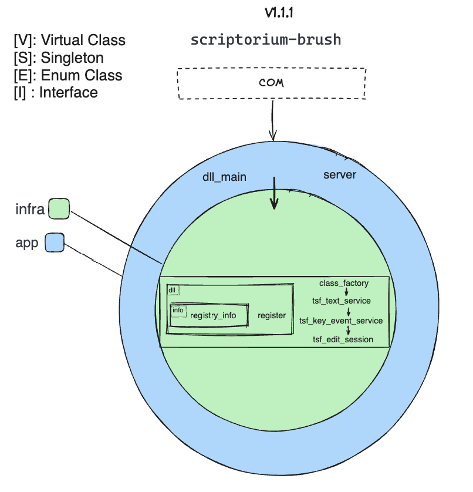

# Scriptorium Brush

[](https://github.com/ScriptoriumLab/scriptorium-brush/actions/workflows/scriptorium-brush-platform-ci.yml)

[](https://opensource.org/licenses/Apache-2.0)

> The Windows TSF platform adapter for Scriptorium.

**Scriptorium Brush** integrates the [Scriptorium](https://github.com/ScriptoriumLab) input method with Windows through the Microsoft Text Services Framework (TSF).

It runs in-process as a Windows text service and translates between native Windows text-input mechanisms and Scriptorium's platform-independent input-method model.

Brush deliberately keeps input-method business logic, dictionaries, candidate generation, ranking, and presentation outside the host application's process.

---

## Role in Scriptorium

Scriptorium separates platform integration, input-method logic, presentation, and shared infrastructure into independently evolving components.


Within that architecture:

- **Scriptorium Brush** integrates Scriptorium with Windows through the Text Services Framework.
- **[Scriptorium Inkstone](https://github.com/ScriptoriumLab/scriptorium-inkstone)** owns authoritative input-method state and behavior such as composition, segmentation, dictionary lookup, candidate generation, and ranking.
- **[Scriptorium Ink](https://github.com/ScriptoriumLab/scriptorium-ink)** renders candidate windows and other user-facing state without owning input-method business state.
- **[Scriptorium Felt](https://github.com/ScriptoriumLab/scriptorium-felt)** provides shared protocols, IPC abstractions, and reusable infrastructure.

Brush is therefore a **platform adapter**, not the input-method engine itself.

Its responsibility is to translate between Windows and Scriptorium:

```text
Windows / TSF
     │
     ▼
   Brush
     │
     ▼
Scriptorium Protocol
     │
     ▼
  Inkstone
```

This boundary keeps Windows-specific APIs and concepts out of the platform-independent input-method core.

A future platform adapter can fulfill the same architectural role for another operating system without requiring Inkstone to understand TSF or other native input-method frameworks.

---

## Responsibilities

Brush is intentionally narrow in scope.

Its responsibilities can be understood through three complementary roles.

### Sensor

Brush observes input and text-service events exposed by Windows TSF.

It translates Windows-specific information into Scriptorium models that can be understood by the input-method core.

Examples include:

- keyboard input
- text-service lifecycle events
- composition-related platform context
- active text context information
- other native events required by the input-method workflow

Brush determines how Windows events are represented.

It does **not** decide what input-method behavior those events should produce.

That decision belongs to Inkstone.

### Messenger

Brush communicates with the rest of Scriptorium through shared IPC and protocol boundaries.

Conceptually:

```text
TSF Event
   │
   ▼
 Brush
   │
   │ Scriptorium message
   ▼
Inkstone
```

and in the opposite direction:

```text
Inkstone
   │
   │ Platform command
   ▼
 Brush
   │
   ▼
Windows TSF
```

The current Windows implementation uses Named Pipes through shared Scriptorium infrastructure.

The transport itself remains an implementation detail rather than part of Brush's architectural identity.

### Actuator

Brush executes Windows-specific text operations requested by the input-method core.

Examples include:

- creating or updating TSF compositions
- committing text into the active application
- interacting with the current TSF context
- scheduling edit sessions
- translating Scriptorium commands into native Windows operations

A useful distinction is:

> Inkstone decides **what** the input method should do.  
> Brush decides **how Windows performs it**.

---

## What Brush Does Not Own

Brush deliberately does **not** own input-method business logic.

In particular, it does not own:

- Pinyin processing
- segmentation
- dictionaries
- candidate generation
- candidate ranking
- authoritative candidate state
- input-method composition policy
- candidate-window presentation

These responsibilities belong to Inkstone and Ink.

This boundary matters because Brush runs inside applications that load the Windows text service.

Keeping Brush small reduces the amount of Scriptorium functionality executing inside host processes and prevents Windows-specific concerns from spreading into the rest of the system.

---

## Architecture

Brush isolates Windows COM and TSF integration inside a small platform-specific component.

The current V1.1.1 architecture contains two main layers:

```text
App → Infra
```



The key architectural rule is:

> Process lifecycle and composition belong to App; Windows integration details belong to Infra.

Unlike Inkstone, Brush is intentionally platform-specific.

Its purpose is not to hide the fact that Windows APIs exist internally, but to **contain them so they do not leak beyond the Windows platform boundary**.

---

### App

The outer **App** layer defines Brush's runtime and DLL boundary.

Current components include:

- `dll_main`
- `server`

The App layer is responsible for assembling and operating the Windows text-service component.

Its responsibilities include:

- DLL lifecycle
- application-level composition
- wiring infrastructure components together
- starting and coordinating communication with the wider Scriptorium runtime
- exposing the runtime boundary through which Brush participates in Scriptorium

Conceptually:

```text
Windows loads DLL
       │
       ▼
    dll_main
       │
       ▼
   App runtime
       │
       ├──── server
       │
       ▼
     Infra
```

The App layer should coordinate the component rather than contain detailed COM or TSF behavior itself.

---

### Infra

The **Infra** layer contains the Windows-specific implementations required to participate in COM and TSF.

Current responsibilities include two broad areas:

```text
Registration / COM activation
TSF runtime integration
```

#### Registration and COM Activation

Brush must be registered and activatable as a Windows COM component.

The registration path contains components such as:

- `registry_info`
- `register`
- DLL-related infrastructure
- `class_factory`

These components deal with Windows-specific concerns such as:

- COM registration
- registry metadata
- component activation
- construction of the TSF text service

Conceptually:

```text
COM
 │
 ▼
class_factory
 │
 ▼
tsf_text_service
```

This machinery belongs at the platform boundary and should remain isolated from the input-method core.

#### TSF Runtime

The runtime integration is built around the TSF text service and the services that implement its Windows-facing behavior.

Current components include:

- `tsf_text_service`
- `tsf_key_event_service`
- `tsf_edit_session`

Their responsibilities are separated by platform concern.

##### `tsf_text_service`

`tsf_text_service` represents the primary TSF-facing text service.

It participates in the Windows text-service lifecycle and coordinates the lower-level TSF services required by Brush.

It acts as the primary bridge between Windows TSF and the rest of the Brush runtime.

##### `tsf_key_event_service`

`tsf_key_event_service` handles keyboard interaction exposed through TSF.

Its responsibility is to interpret Windows key events at the platform boundary and translate them into the form required by Scriptorium.

It should understand Windows keyboard concepts where necessary, but those concepts should not propagate into Inkstone.

##### `tsf_edit_session`

`tsf_edit_session` encapsulates text modifications that must be performed through TSF edit sessions.

Windows controls when and under what access rules text can be modified.

This component contains those mechanics so that the rest of Scriptorium can reason in terms of input-method operations rather than TSF edit-session semantics.

---

## Dependency Direction

The current Brush structure can be summarized as:

```text
COM / Windows
      │
      ▼
     App
      │
      ▼
    Infra
```

Inside Infra, the runtime collaboration is conceptually:

```text
class_factory
      │
      ▼
tsf_text_service
      │
      ▼
tsf_key_event_service
      │
      ▼
tsf_edit_session
```

The exact call graph may vary by operation, but the architectural boundary remains the same:

- App owns runtime composition.
- Infra owns Windows integration.
- Scriptorium protocol and shared infrastructure come from Felt.
- Input-method policy remains in Inkstone.

---

## Platform Translation

Brush acts as an anti-corruption boundary between Windows and the platform-independent parts of Scriptorium.

Windows exposes input through concepts such as:

- COM objects
- TSF interfaces
- virtual-key codes
- scan codes
- modifier state
- keyboard layouts
- text contexts
- edit sessions
- Windows registry and component registration

These concepts are necessary at the Windows boundary.

They should not become the input-method domain model.

Conceptually:

```text
Windows Representation
        │
        ▼
      Brush
        │
        ▼
Scriptorium Representation
```

The reverse translation occurs when Inkstone requests a platform operation:

```text
Scriptorium Command
        │
        ▼
      Brush
        │
        ▼
 Windows / TSF Operation
```

This allows Inkstone to operate on input-method concepts rather than Windows API concepts.

---

## COM and TSF Boundary

Brush is both a COM component and a TSF text service.

This introduces constraints that are specific to Windows:

- Windows controls object activation through COM.
- TSF controls text-service lifecycle and callbacks.
- text modifications frequently require edit sessions.
- Brush executes inside the host application's process.
- registration changes Windows system state.

These are real platform constraints and are intentionally handled inside Brush rather than abstracted into the input-method core.

This is one of the central reasons Brush exists as a separate repository.

---

## Failure Isolation

Brush itself runs in-process, so failures inside Brush can affect the application that loaded it.

The architecture therefore does not claim that Brush is inherently crash-proof.

Instead, Scriptorium minimizes the amount of functionality that must execute inside the host process.

Responsibilities such as:

- Pinyin processing
- segmentation
- dictionary lookup
- candidate generation
- ranking
- authoritative input-method state
- UI rendering

run outside Brush.

This reduces the amount of complex and independently evolving code hosted inside applications such as editors, browsers, or office software.

Failures or restarts in Inkstone or Ink therefore do not require those components to share the host application's process.

---

## Design Principles

### Thin Platform Adapter

Brush should contain only the responsibilities necessary to integrate Scriptorium with Windows.

Input-method behavior should not migrate into Brush merely because Windows is currently the first supported platform.

### Translate, Don't Decide

Brush translates between Windows and Scriptorium.

It may decide how a Windows event should be represented or how a Scriptorium command should be executed through TSF.

It should not decide:

- how input is segmented
- which candidates should exist
- how candidates are ranked
- what the authoritative composition state should be

Those are input-method decisions and belong to Inkstone.

### Contain Platform Complexity

COM, TSF, registry operations, edit sessions, and native keyboard representations are legitimate Brush concerns.

They should remain inside Brush rather than leaking into shared models or the input-method core.

### Shared Protocol Ownership

Shared Scriptorium protocol models belong to Felt.

Brush consumes those contracts rather than defining an independent Brush-specific protocol.

This prevents the Windows adapter and the input-method core from developing competing sources of truth.

### Minimize In-Process Responsibility

Because Brush executes inside host applications, every additional responsibility increases the amount of code capable of affecting those processes.

Keeping Brush small is therefore both an architectural and reliability concern.

### Evolution Without Lock-In

TSF is a Windows platform constraint.

It should not become a Scriptorium-wide constraint.

By isolating TSF behind Brush, the core, UI, infrastructure, and future platform adapters can evolve independently.

---

## Test Strategy

### Unit Tests

Unit tests focus on behavior that can be isolated from a live TSF environment.

Examples include:

- translation between Windows events and Scriptorium models
- registration-related behavior
- adapter logic
- key-event normalization
- state transitions around platform boundaries
- error handling

Where practical, Windows dependencies are kept behind narrow boundaries so that behavior can be tested without requiring a complete running text-service environment.

---

## Building

### Prerequisites

Brush currently targets Windows.

Development requires:

- Windows
- Visual Studio with C++ development tools
- a C++23-compatible MSVC toolchain
- CMake
- Windows SDK

### Configure

```powershell
cmake -B build
```

### Build

```powershell
cmake --build build
```

Exact generator and configuration options may vary depending on the local development environment.

For complete Scriptorium development workflows, the project is increasingly designed to be built and operated through [Scriptorium CLI](https://github.com/ScriptoriumLab/scriptorium-cli).

---

## Registration and Development

Brush must be registered with Windows before it can participate in the Text Services Framework.

Because COM and TSF registration modify Windows system state, Scriptorium development favors isolated development environments instead of requiring contributors to repeatedly modify their primary host environment.

[Scriptorium CLI](https://github.com/ScriptoriumLab/scriptorium-cli) provides the higher-level development workflow for tasks such as:

- building Scriptorium components
- preparing an isolated environment
- registering Brush
- starting the Scriptorium runtime
- running tests
- cleaning development state

For example:

```powershell
orium dev
```

Lower-level manual registration remains useful when debugging Brush-specific COM or TSF behavior, while the CLI provides the preferred system-level workflow.

---

## Project Status

Scriptorium Brush is under active development.

The current implementation provides the Windows TSF integration required by the Scriptorium runtime.

Ongoing work continues to improve areas such as:

- TSF lifecycle integration
- key-event normalization
- composition behavior
- edit-session handling
- COM registration and activation
- IPC reliability
- failure recovery
- test coverage
- integration with the wider Scriptorium development workflow

Detailed implementation work and technical debt are tracked through GitHub Issues rather than maintained as a static roadmap in this README.

---

## Why "Brush"?

The Scriptorium repositories use traditional writing tools as an architectural metaphor.

A **brush** is the instrument that directly interacts with the writing surface.

Likewise, **Scriptorium Brush** is the component that directly interacts with the operating system's text-input environment.

It does not decide what should be written.

It provides the platform-specific mechanism through which the input-method core can observe user input and affect text.

---

## License

Licensed under the **Apache License 2.0**.

See `LICENSE` for details.

---

*Copyright © 2026 ScriptoriumLab.*